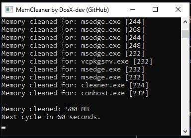
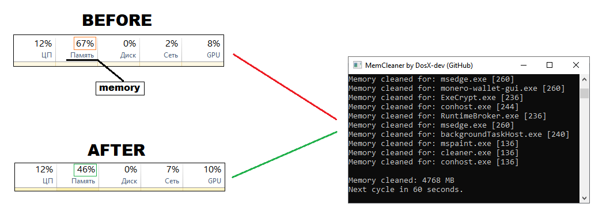

# MemCleaner
A simple memory cleanup utility in C for Windows that enumerates all processes at 40 millisecond intervals and applies an ```EmptyWorkingSet``` for each one (freeing unused memory).

### [Download compiled as .EXE](https://github.com/DosX-dev/MemCleaner/releases/tag/Builds)



